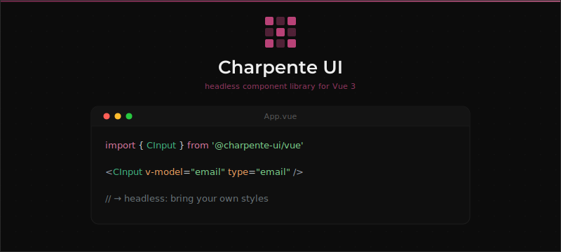

# Charpente UI

[](https://www.npmjs.com/package/@charpente-ui/vue)
[](https://www.npmjs.com/package/@charpente-ui/vue)
[](https://www.npmjs.com/package/@charpente-ui/vue)

## Introduction

A logic-first, headless UI library for Vue 3. The logic you need, without the CSS you don't.

<p align="center">
  
</p>

## Philosophy: Don't Reinvent the Wheel

**Charpente UI** is built on a simple promise: We handle the boring stuff, you handle the design.

Most UI libraries are bloated because they try to impose a visual style. **Charpente UI** is headless. We provide the
"chassis" _(HTML structure and complex input logic)_ and you bring the "paint" _(Tailwind, CSS Modules, or
Styled Components)_.

### Core Principles:

* **Zero Style:** No CSS included. Total freedom for your UI.
* **Transparent Wrapper:** We don't hide native HTML. Attributes like type, placeholder, or required work exactly like
  standard HTML via attribute inheritance.
* **Smart Logic:** Complex components like `CCheckbox` or `CRadio` handle array management and state internally so you
  don't have to "take the lead" on complex boilerplate.

## Installing

```shell
npm install @charpente-ui/vue
```

## Playground

Try it live on StackBlitz — no installation required:

[](https://stackblitz.com/~/github.com/charpente-ui/vue)

Or run it locally:

```shell
npm run dev
```

## Usage

```vue
<script setup>
    import { ref } from 'vue';
    import { CInput, CButton, CLabel } from '@charpente-ui/vue';

    const email = ref('');
</script>

<template>
    <div class="form-group">
        <CLabel for="email-field">Email Address</CLabel>

        <CInput id="email-field" v-model="email" type="email" placeholder="hello@world.com"
                class="my-custom-input-style"/>

        <CButton @click="submit" class="btn-primary">
            Subscribe
        </CButton>
    </div>
</template>
```

## Component Reference

1. **Form Inputs** **(CInput, CTextarea, CSelect)**

These components are thin wrappers around native elements. They use `v-model` and automatically link with labels via
`useId()`. Full attribute inheritance.

2. **Selection Logic** _(CCheckbox, CRadio, CSelect)_

Managing checkbox arrays in Vue can be repetitive. **Charpente UI** simplifies this:

```vue
<CCheckbox v-model="tags" value="foo"/>
<CCheckbox v-model="tags" value="bar"/>
```

`CCheckbox` also supports the `indeterminate` state for partial selections:

```vue
<CCheckbox v-model="allSelected" :indeterminate="someSelected"/>
```

`CSelect` supports multiple selection via the native `multiple` attribute:

```vue
<CSelect v-model="selectedItems" multiple>
    <option value="foo">Foo</option>
    <option value="bar">Bar</option>
</CSelect>
```

3. **Group Components** _(CRadioGroup, CCheckboxGroup)_

Groups wrap related inputs in a semantic `<fieldset>`, sharing a `v-model` and a `name` attribute across all children
automatically.

```vue
<CRadioGroup v-model="selected">
    <CLabel for="opt-a">Option A</CLabel>
    <CRadio id="opt-a" value="a"/>

    <CLabel for="opt-b">Option B</CLabel>
    <CRadio id="opt-b" value="b"/>
</CRadioGroup>
```

```vue
<CCheckboxGroup v-model="selected">
    <CLabel for="cb-a">Option A</CLabel>
    <CCheckbox id="cb-a" value="a"/>

    <CLabel for="cb-b">Option B</CLabel>
    <CCheckbox id="cb-b" value="b"/>
</CCheckboxGroup>
```

The `name` attribute is auto-generated via `useId()` and shared across all children. Override it on the group or on
individual inputs:

```vue
<CRadioGroup v-model="selected" name="my-group">...</CRadioGroup>
```

4. **Polymorphic Elements** _(CButton)_

The button can change its HTML tag while keeping its behavior.

```vue
<CButton as="a" href="/login">Login Link</CButton>
<CButton as="RouterLink" to="/dashboard">Dashboard</CButton>
```

## Components

| Name          | Core Logic                                                                       | Tag              | Status |
|---------------|----------------------------------------------------------------------------------|------------------|--------|
| Button        | **Polymorphic:** Switches tags _(a, button, etc...)_ while keeping logic.        | `CButton`        | Ready  |
| Checkbox      | **Smart Toggle:** Handles array state, booleans, and indeterminate natively.     | `CCheckbox`      | Ready  |
| CheckboxGroup | **Group:** Shared v-model and name across checkboxes inside a fieldset.          | `CCheckboxGroup` | Ready  |
| File          | **File Input:** Reactive file selection with `v-model` support.                  | `CFile`          | Ready  |
| Form          | **Auto-Submit:** Integrated `preventDefault` and event handling.                 | `CForm`          | Ready  |
| Input         | **Auto-ID:** Auto-links to labels via `useId()` and full attributes inheritance. | `CInput`         | Ready  |
| Label         | **Context-Aware:** Simple, accessible binding for any input.                     | `CLabel`         | Ready  |
| Radio         | **Selection:** Minimalist wrapper for native radio input.                        | `CRadio`         | Ready  |
| RadioGroup    | **Group:** Shared v-model and name across radios inside a fieldset.              | `CRadioGroup`    | Ready  |
| Select        | **Native Wrapper:** Single and multiple selection support.                       | `CSelect`        | Ready  |
| Textarea      | **Flexible Binding:** Auto-ID and reactive model management.                     | `CTextarea`      | Ready  |
