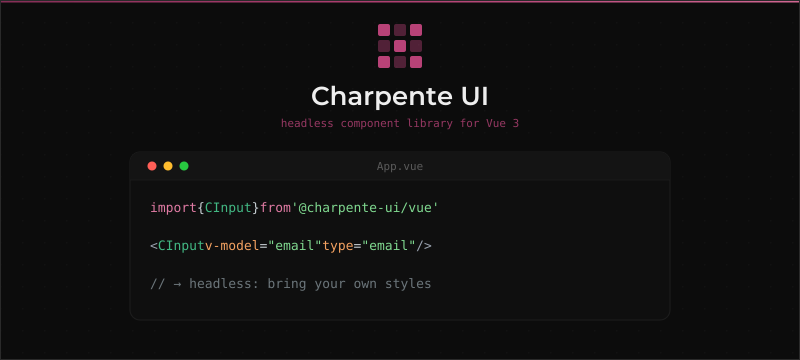

# Charpente UI

[](https://www.npmjs.com/package/@charpente-ui/vue)
[](https://www.npmjs.com/package/@charpente-ui/vue)
[](https://www.npmjs.com/package/@charpente-ui/vue)

## Introduction

A logic-first, headless UI library for Vue 3. The logic you need, without the CSS you don't.

<p align="center">
  
</p>

## Philosophy: Don't Reinvent the Wheel

**Charpente UI** is built on a simple promise: We handle the boring stuff, you handle the design.

Most UI libraries are bloated because they try to impose a visual style. **Charpente UI** is headless. We provide the
"chassis" _(HTML structure and complex input logic)_ and you bring the "paint" _(Tailwind, CSS Modules, or Styled
Components)_.

### Core Principles:

* **Zero Style:** No CSS included. Total freedom for your UI.
* **Transparent Wrapper:** We don't hide native HTML. Attributes like type, placeholder, or required work exactly like
  standard HTML via attribute inheritance.
* **Smart Logic:** Complex components like `CCheckbox` or `CRadio` handle array management and state internally so you
  don't have to "take the lead" on complex boilerplate.

## Installing

```shell
npm install @charpente-ui/vue
```

## Playground

Try it live on StackBlitz — no installation required:

[](https://stackblitz.com/~/github.com/charpente-ui/vue)

Or run it locally:

```shell
npm run dev
```

## Usage

```vue
<script setup>
    import { ref } from 'vue';
    import { CForm, CField, CLabel, CInput, CSupportingText, CButton } from '@charpente-ui/vue';

    const email = ref('');

    function onSubmit() {
        // Only called once the form passes native validation.
    }
</script>

<template>
    <CForm validate @submit="onSubmit">
        <CField class="form-group">
            <CLabel>Email Address</CLabel>

            <CInput v-model="email" type="email" placeholder="hello@world.com" required
                    class="my-custom-input-style"/>

            <CSupportingText validation>We never share your email.</CSupportingText>
        </CField>

        <CButton type="submit" class="btn-primary">
            Subscribe
        </CButton>
    </CForm>
</template>
```

No `for`/`id` wiring, no validation library: the label, the hint and the browser-localized error messages are linked and
accessible automatically — and every class lands on the native element, ready for your CSS.

## Component Reference

1. **Form Inputs** **(CInput, CTextarea, CSelect)**

These components are thin wrappers around native elements. They use `v-model` and automatically link with labels via
`useId()`. Full attribute inheritance. `CInput` and `CTextarea` support the native `v-model` modifiers:

> [!NOTE]
> Every auto-generated `id`/`name` is prefixed with `cui-` (e.g. `cui-v-0`), so it never collides with an id from the
> host app or another component library on the same page. Pass an explicit `id`/`name` to opt out.

```vue
<CInput v-model.trim="name"/>
<CInput v-model.number="age"/>
<CInput v-model.lazy="query"/>
```

2. **Selection Logic** _(CCheckbox, CRadio, CSelect)_

Managing checkbox arrays in Vue can be repetitive. **Charpente UI** simplifies this:

```vue
<CCheckbox v-model="tags" value="foo"/>
<CCheckbox v-model="tags" value="bar"/>
```

`CCheckbox` also supports the `indeterminate` state for partial selections:

```vue
<CCheckbox v-model="allSelected" :indeterminate="someSelected"/>
```

`CSelect` supports multiple selection via the native `multiple` attribute:

```vue
<CSelect v-model="selectedItems" multiple>
    <option value="foo">Foo</option>
    <option value="bar">Bar</option>
</CSelect>
```

### Declaring options with a prop

Writing `<option>` by hand gets tedious when the list comes from data, so `CSelect` also accepts an `options` prop.
Each entry is either a `{ label, value, disabled? }` object or a plain string/number used as both label and value:

```vue
<CSelect v-model="fruit" :options="['apple', 'banana']"/>

<CSelect
    v-model="fruit"
    :options="[
        { label: 'Apple', value: 'apple' },
        { label: 'Banana', value: 'banana', disabled: true }
    ]"
/>
```

An entry carrying its own `options` array renders an `<optgroup>`:

```vue
<CSelect
    v-model="fruit"
    :options="[
        { label: 'Citrus', options: ['lemon', 'orange'] },
        { label: 'Berries', options: ['strawberry'], disabled: true }
    ]"
/>
```

Values are bound with `:value`, so numbers, and anything else you put in `value`, survive the round-trip — the
`v-model` gives you back exactly what you passed in.

The prop **completes** the slot, it does not replace it. Slot content renders first, which is what you want for a
placeholder:

```vue
<CSelect v-model="fruit" :options="fruits">
    <option value="" disabled>Choose a fruit…</option>
</CSelect>
```

The `SelectOption`, `SelectOptionGroup` and `SelectOptionItem` types are exported for typing your own lists.

3. **Group Components** _(CRadioGroup, CCheckboxGroup)_

Groups wrap related inputs in a semantic `<fieldset>`, sharing a `v-model` and a `name` attribute across all children
automatically.

```vue
<CRadioGroup v-model="selected">
    <legend>Favorite fruit</legend>

    <CLabel for="opt-a">Option A</CLabel>
    <CRadio id="opt-a" value="a"/>

    <CLabel for="opt-b">Option B</CLabel>
    <CRadio id="opt-b" value="b"/>
</CRadioGroup>
```

```vue
<CCheckboxGroup v-model="selected">
    <legend>Favorite fruits</legend>

    <CLabel for="cb-a">Option A</CLabel>
    <CCheckbox id="cb-a" value="a"/>

    <CLabel for="cb-b">Option B</CLabel>
    <CCheckbox id="cb-b" value="b"/>
</CCheckboxGroup>
```

### Naming the group

A `<fieldset>` takes its accessible name from a `<legend>`, so that's what names the group — pass one as the first
child and the browser does the rest. There is no `CLegend`: the native element already works, and the group renders
your slot content untouched.

> [!WARNING]
> Do **not** use `CLabel` to name a group. A `<label for>` can only point at a labelable element, and a `<fieldset>`
> is not one. Inside a group `CLabel` also finds no field id to pick up (the group masks any surrounding `CField`
> on purpose), so it renders a `<label>` with no `for` at all — a label attached to nothing, silently. `CLabel` is
> for individual controls; `<legend>` is for the group.

Set `name` on the group and every child inherits it. A child can still override it with its own `name` attribute.

```vue
<CRadioGroup v-model="selected" name="my-group">...</CRadioGroup>
<CCheckboxGroup v-model="selected" name="my-group">...</CCheckboxGroup>
```

The two groups differ when you leave `name` out, on purpose:

- **`CCheckboxGroup` emits no `name`.** The attribute is the key your data is submitted under, and the library
  cannot know your server's schema — inventing one would post the boxes under a meaningless key. With no `name`,
  the boxes are simply not submitted, which is what you asked for by omitting it. `v-model` is unaffected.
- **`CRadioGroup` falls back to a generated name** (`useId()`, shared across the children). On radios the shared
  `name` is not just a payload key: the browser relies on it for arrow-key navigation between the buttons and for
  group-level `required` validation. Without it a forgotten `name` would silently break keyboard accessibility, so
  the fallback trades a throwaway key in `FormData` for behaviour that works out of the box.

Set `name` explicitly on `CRadioGroup` whenever the form is submitted natively, and the generated value never
reaches your payload.

> [!NOTE]
> Standalone `CRadio` and `CCheckbox` accept any `value` (strings, numbers, booleans, objects — `v-model` compares by
> reference, as in native Vue). Inside a group, the group `v-model` is typed `string | number`
> (`(string | number)[]` for checkboxes): stick to those value types in grouped mode, as TypeScript cannot enforce it
> on the `value` prop without dropping standalone object support.

### Describing a group

Wrapped in a `CField`, a group is described as a whole: the `<fieldset>` carries the `aria-describedby` pointing at the
supporting texts and the `aria-invalid` flag, so a screen reader announces the hint or the error once when entering the
group rather than on every item. Write the `CSupportingText` inside the group or next to it — both register with the
field.

```vue
<CField>
    <CRadioGroup v-model="plan">
        <legend>Plan</legend>
        <CRadio value="free"/>
        <CRadio value="pro"/>
        <CSupportingText validation/>
    </CRadioGroup>
</CField>
```

The items themselves get no `aria-describedby`, no `aria-invalid` and no field `id` — each keeps its own generated id so
labels stay paired one-to-one. Set `aria-describedby` or `aria-invalid` on the group to override either.

4. **Polymorphic Elements** _(CButton)_

The button can change its HTML tag while keeping its behavior.

```vue
<CButton as="a" href="/login">Login Link</CButton>
<CButton as="RouterLink" to="/dashboard">Dashboard</CButton>
```

When rendering a native `<button>`, `CButton` defaults to `type="button"` (instead of the native `type="submit"`) to
avoid accidental form submissions. Pass `type="submit"` explicitly for submit buttons.

5. **Field Wrapper** _(CField)_

`CField` links a label and an input automatically: it provides a shared auto-generated id that `CLabel` picks up as
`for` and the wrapped input picks up as `id` — no manual wiring.

```vue
<CField>
    <CLabel>Email</CLabel>
    <CInput v-model="email" type="email"/>
</CField>
```

`CSupportingText` renders a field's hint or error text inside a `CField`: the input automatically gets an
`aria-describedby` pointing to it, and the attribute is removed when the text unmounts (e.g. behind a `v-if`). Several
supporting texts in the same field are all referenced, in mount order — a permanent hint and a conditional error can
coexist.

```vue
<CField>
    <CLabel>Email</CLabel>
    <CInput v-model="email" type="email"/>
    <CSupportingText v-if="error">{{ error }}</CSupportingText>
</CField>
```

An explicit `aria-describedby` on the input always wins, and a standalone `CSupportingText` (outside a field)
simply renders its content with an id. Likewise, an explicit `id` on the input or `for` on the label always wins over
the field id.

Passing `id` to `CField` itself names that pairing instead of the wrapper `<div>` — reusing it on both would put the
same id on two different DOM elements:

```vue
<CField id="email-field">
    <CLabel>Email</CLabel>
    <CInput v-model="email" type="email"/>
</CField>
```

Renders `<label for="email-field">` and `<input id="email-field">`; the `<div>` itself gets no `id`. Use `class`
to target the wrapper.

A `CField` wrapping a whole group is ignored by the items (a single id must not land on every input); wrap each item in
its own `CField` instead:

```vue
<CRadioGroup v-model="selected">
    <CField>
        <CLabel>Option A</CLabel>
        <CRadio value="a"/>
    </CField>

    <CField>
        <CLabel>Option B</CLabel>
        <CRadio value="b"/>
    </CField>
</CRadioGroup>
```

6. **Native Validation** _(CForm + CField + CSupportingText)_

Browsers already validate forms (`required`, `type="email"`, `minlength`, `pattern`…) and localize their error messages
for free. Charpente UI exposes that instead of reinventing it — opt in with the `validate` prop:

```vue
<CForm validate @submit="onSubmit">
    <CField>
        <CLabel>Email</CLabel>
        <CInput v-model="email" type="email" required/>
        <CSupportingText validation>We never share your email.</CSupportingText>
    </CField>
</CForm>
```

- `CForm validate` suppresses the native bubbles (`novalidate`), blocks `submit` until the form is valid, and focuses
  the first invalid control.
- Errors appear after the first submit attempt, then update live as the user fixes the value. Resetting the form
  (`<button type="reset">` or `form.reset()`) clears them along with the values, back to the pre-submit state.
- `CSupportingText validation` shows the browser's localized `validationMessage` while invalid, and falls back to its
  slot content otherwise. The control also gets `aria-invalid` automatically, and the text becomes a
  `role="alert"` live region so screen readers announce the message when it swaps in. Pass an explicit `role`
  (e.g. `role="status"` for a gentler, polite announcement) to override it.
- Without `validate`, nothing changes — bring your own validation library if you need cross-field or async rules.
- Native escapes still work: a submit button carrying `formnovalidate` skips validation for its own submission, so
  `submit` is emitted with the form still invalid. The HTML spec puts the no-validate state on the submitter as much
  as on the form, and `validate` honours it — that's what a "save draft" button next to a "publish" one relies on.

```vue
<CForm validate @submit="onSubmit">
    <CField>
        <CLabel>Title</CLabel>
        <CInput v-model="title" required/>
    </CField>

    <CButton type="submit">Publish</CButton>
    <CButton type="submit" formnovalidate>Save draft</CButton>
</CForm>
```

> [!WARNING]
> `validate` guarantees a valid form on `submit` **except** when the submitter carries `formnovalidate`. Read
> `event.submitter` in your handler if the two paths need to behave differently.

### How `CField` tracks validity: the events it listens to

`CField` never calls the Constraint Validation API itself — it listens to three native events on its wrapper `<div>`,
all in the **capture phase**, so they're caught on the way down regardless of which control inside the field fired them:

| Event                      | When it fires                                                             | What `CField` does                                                                               |
|----------------------------|---------------------------------------------------------------------------|--------------------------------------------------------------------------------------------------|
| `invalid` (capture)        | The browser rejects a control's value on submit/`checkValidity()`         | Sets `invalid = true` and `message` to the control's `validationMessage`                         |
| `input` (capture)          | The user types/changes a value, before the field was ever flagged invalid | Ignored — no cost paid until the field actually fails once                                       |
| `input`/`change` (capture) | The user edits a value **after** the field was flagged invalid            | Re-checks `target.validity.valid` live, clearing `invalid`/`message` as soon as the value passes |

The `invalid` event matters here because it **does not bubble** — it only reaches ancestors during the capture phase, so
`@invalid.capture` on the field's own root is the only way to observe it without wiring a listener on every control by
hand. `input`/`change` are only used *after* the first `invalid`, so a field that has never failed validation pays no
per-keystroke cost.

`CField` stays zero-CSS: it never applies a class itself. If you need custom styling beyond `[aria-invalid]` or
`:invalid` selectors, it gives you two ways to read its `invalid`/`message` state:

- **Default slot** — reaches elements placed directly inside `CField`:

```vue
<CField v-slot="{ invalid, message }">
    <CLabel>Email</CLabel>
    <CInput v-model="email" type="email" required :class="{ 'is-invalid': invalid }"/>
    <span v-if="invalid" class="error">{{ message }}</span>
</CField>
```

- **Template ref** — to style `CField`'s own wrapper element instead of a child:

```vue
<CField ref="fieldRef" :class="{ 'is-invalid': fieldRef?.invalid }">
    <CLabel>Email</CLabel>
    <CInput v-model="email" type="email" required/>
</CField>
```

Both only reach elements placed directly inside `CField`'s default slot, or the `CField` element itself — a custom
component nested deeper won't receive `invalid`/`message` automatically; pass them down as props if you need that.

### Wiring a control `CField` doesn't own

`CLabel`, `CInput` & co. pick up the field's id and `aria-describedby` by injection. A plain `<input>`, or a third-party
component like a date picker, can't — so the default slot hands both out for you to bind by hand:

```vue
<CField v-slot="{ id, describedBy, invalid }">
    <CLabel>Date of birth</CLabel>
    <VueDatePicker :uid="id" :aria-describedby="describedBy" :aria-invalid="invalid || undefined"/>
    <CSupportingText validation>DD/MM/YYYY</CSupportingText>
</CField>
```

`id` is the field's own id — the one `CLabel` points its `for` at — and `describedBy` is the space-separated list of the
ids of every `CSupportingText` registered in the field. Both stay reactive: a supporting text mounted or unmounted later
updates `describedBy` on the spot.

> [!NOTE]
> A third-party component only ends up accessible if it forwards that id down to its real `<input>`. Check its API
> (`uid`, `input-id`, `inputProps`…) instead of assuming a plain `id` lands on the right element.

## Accessibility

The library leans on native elements, so most of the accessible behaviour comes from the browser rather than from ARIA.
What follows is the contract: what you get without asking, and what stays yours.

### What the library wires for you

| Behaviour                  | How                                                                                     |
|----------------------------|-----------------------------------------------------------------------------------------|
| Label ↔ control pairing    | `CField` shares a generated id, `CLabel` picks it up as `for`.                          |
| Hint and error association | `CSupportingText` registers its id, controls expose it as `aria-describedby`.           |
| Invalid state              | `aria-invalid` follows native constraint validation, and clears as the user types.      |
| Error announcement         | `CSupportingText validation` becomes a `role="alert"` live region.                      |
| Group description          | The `<fieldset>` carries the wiring once, not each item. [Details](#describing-a-group) |
| Radio group keyboard nav   | A shared `name` keeps native arrow-key navigation working. [Details](#naming-the-group) |
| Focus on submit            | `CForm validate` focuses the first invalid control instead of failing silently.         |

Every one of these can be overridden: pass `aria-describedby`, `aria-invalid` or `role` explicitly and yours wins.

### What stays your responsibility

**Name every group with a `<legend>`.** A `<fieldset>` takes its accessible name from its legend, and nothing else will
do — see the warning in [Naming the group](#naming-the-group). `CLabel` cannot name a group: a `<label for>`
only points at a labelable element, and inside a group `CLabel` finds no id to bind, so it silently renders a label
attached to nothing.

**`CButton` guarantees no semantics beyond the tag you choose.** With `as="button"` (the default) you get everything
natively. With `as="div"` or `as="span"` you get an element with no role, no `tabindex` and no keyboard activation —
invisible to assistive technology. And `disabled` is inert on anything that is not a form control, so
`<CButton as="a" disabled>` stays focusable and clickable. Pass the ARIA yourself, or keep a real `<button>`.

**One control per `CField`.** The wrapper tracks a single validation message, so two controls inside the same field
overwrite each other's — the last one to fire `invalid` wins. Wrap each control in its own `CField`; use
`CRadioGroup`/`CCheckboxGroup` for a set of related items, which is handled as a single control on purpose.

**Anything the browser cannot infer.** `aria-label` on an icon-only button, `aria-expanded` on a disclosure trigger,
`aria-current` on a nav link: the library never guesses these, because it does not know what you are building.

> [!NOTE]
> The wiring above is verified by unit and end-to-end tests asserting the rendered attributes. That is not the same
> as validation with a real screen reader — notably, `aria-invalid` on a `<fieldset>` is valid but unevenly announced
> across assistive technologies. Test your own critical flows.

## Components

| Name           | Core Logic                                                                       | Tag               | Status |
|----------------|----------------------------------------------------------------------------------|-------------------|--------|
| Button         | **Polymorphic:** Switches tags _(a, button, etc...)_ while keeping logic.        | `CButton`         | Ready  |
| Checkbox       | **Smart Toggle:** Handles array state, booleans, and indeterminate natively.     | `CCheckbox`       | Ready  |
| CheckboxGroup  | **Group:** Shared v-model and opt-in name across checkboxes inside a fieldset.   | `CCheckboxGroup`  | Ready  |
| Field          | **Wrapper:** Auto-links a label and an input via a shared generated id.          | `CField`          | Ready  |
| File           | **File Input:** Reactive file selection with `v-model` support.                  | `CFile`           | Ready  |
| Form           | **Auto-Submit:** `preventDefault` handling and opt-in native validation.         | `CForm`           | Ready  |
| Input          | **Auto-ID:** Auto-links to labels via `useId()` and full attributes inheritance. | `CInput`          | Ready  |
| Label          | **Context-Aware:** Simple, accessible binding for any input.                     | `CLabel`          | Ready  |
| Radio          | **Selection:** Minimalist wrapper for native radio input.                        | `CRadio`          | Ready  |
| RadioGroup     | **Group:** Shared v-model and name across radios inside a fieldset.              | `CRadioGroup`     | Ready  |
| Select         | **Native Wrapper:** Single and multiple selection support.                       | `CSelect`         | Ready  |
| SupportingText | **Field Text:** Hint or error text wired to its input via `aria-describedby`.    | `CSupportingText` | Ready  |
| Textarea       | **Flexible Binding:** Auto-ID and reactive model management.                     | `CTextarea`       | Ready  |

## Wrapping Components

When wrapping a Charpente UI component inside your own, you must forward `$attrs` so that native HTML attributes (`id`,
`class`, `disabled`, etc.) reach the underlying element instead of landing on your wrapper's root node.

```vue
<script setup>
import { CField, CLabel, CInput, CSupportingText } from '@charpente-ui/vue';

defineOptions({
    inheritAttrs: false
});

defineProps({
    label: String,
    error: String
});

const model = defineModel();
</script>

<template>
    <CField>
        <CLabel>{{ label }}</CLabel>

        <CInput v-bind="$attrs" v-model="model"/>

        <CSupportingText v-if="error">{{ error }}</CSupportingText>
    </CField>
</template>
```

**Why this matters:** Without `inheritAttrs: false`, Vue applies fallthrough attributes to the wrapper's root element
instead of the inner component. Adding `v-bind="$attrs"` on the Charpente component ensures attributes like `id`,
`class`, `required`, or `disabled` pass all the way through to the native HTML element. And since `CField` works by
provide/inject, the label, input and error stay linked across your wrapper's boundary — accessibility included.

This pattern works the same way for all Charpente components (`CInput`, `CCheckbox`, `CRadio`, etc.).
